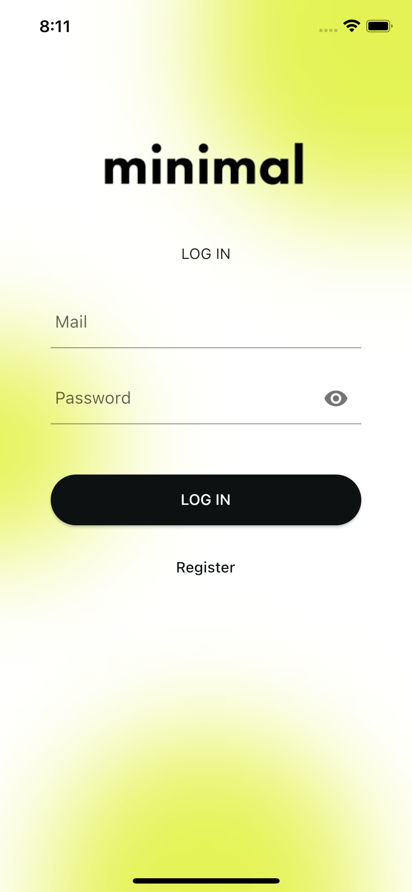
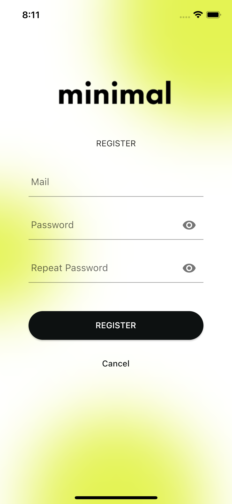
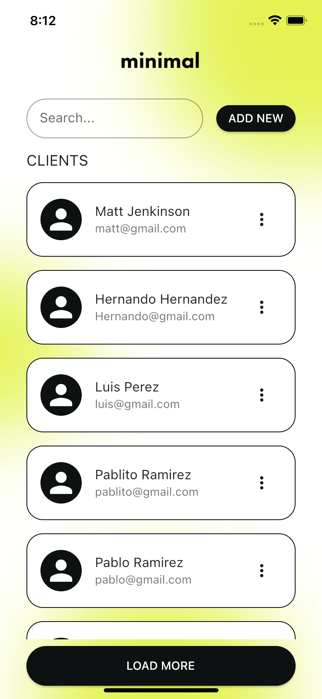

# Coda Code Challenge

Projecto realizado como code challenge para una posición como desarrollador Flutter para Coda.

## About the project
- El proyecto está desarollado siguiendo `clean-architecture`.
- El proyecto está dividido en 3 subproyectos para logram un mejor desacoplamiento de las distintas capas:
  - `domain`: Es un proyecto dart donde está definida toda la lógica de negocio.
  - `data`: Es un proyecto donde están implementadas todas las interfaces para el manejo de datos. Tiene como dependencia a `domain`.
  - `app`: Es la applicación propiamente dicha. Tiene como dependencia a `domain` y `data`.
- En los diseños de Figma no se incluía una pantalla para el registro de un nuevo usuario, pero como se contaba con la API para esto, se agregó dicha funcionalidad.
- En el menú contextual de cada cliente se agrego, además de la opción para editarlo, la opción para borrarlo.
- En el diálogo para crear/editar cliente se agregó el campo de la dirección (`address`).
- El tiempo que me tomó desarollar el proyecto fue alrededor de 12 horas.

## About the API
- Algunos request al servidor funcionan si se envian los headers: `content-type` y `accept` mientras que otros funcionan al no enviarlos.
- Por lo tanto, en `data/lib/src/repositories/network/model` se definieron clases para cada uno de los requests donde se agregan o no los headers descriptos previamente.
- El `accessToken` no es requerido para los endpoints de ABM. Sin embargo se agregó toda la lógica necesaria para guardarlo, validar que este siga siendo válido (valida el campo `exp` del payload) en las siguientes ejecuciones y envío del mismo en cada request al servidor.
- El endpoint getClient (`client/fetch/{clientId}`) no fue utilizado, por lo tanto fue removido de la implementación.

## Releases
- El apk instalable se puede descargar desde la sección [Releases](https://github.com/emanuelnlopez/flutter-coda-challenge/releases)

## Suggested improvements
- La app podría solicitar la siguiente tanda de clientes a medida que se va haciendo scroll por la lista
- la API podría proveer una forma de limitar la cantidad de clientes que se desean obtener en cada request (en lugar de que esté fijo en 50)
- Al crear un usuario, se podría devolver un JWT para utilizarlo de inmediato

## Screenshots

Login Screen | Registration Screen
--- | ----
 | 

Home Screen | Create/Edit Client Dialog
--- | ----
 | 
