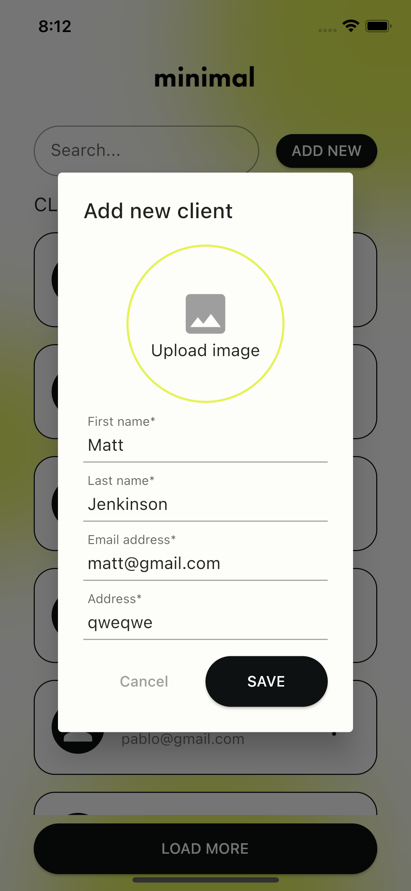

# Coda Code Challenge

Projecto realizado como code challenge para una posición como desarrollador Flutter para Coda.

## About the project
- El proyecto está desarollado siguiendo `clean-architecture`.
- El proyecto está dividido en 3 subproyectos para logram un mejor desacoplamiento de las distintas capas:
  - `domain`: Es un proyecto dart donde está definida toda la lógica de negocio.
  - `data`: Es un proyecto donde están implementadas todas las interfaces para el manejo de datos. Tiene como dependencia a `domain`.
  - `app`: Es la applicación propiamente dicha. Tiene como dependencia a `domain` y `data`.
- En los diseños de Figma no se incluía una pantalla para el registro de un nuevo usuario, pero como se contaba con la API para esto, se agregó dicha funcionalidad.
- En el menú contextual de cada cliente se agrego, además de la opción para editarlo, la opción para borrarlo.

## About the API
- Algunos request al servidor funcionan si se envian los headers: `content-type` y `accept` mientras que otros funcionan al no enviarlos.
- Por lo tanto, en `data/network/model` se definieron clases para cada uno de los requests donde se agregan o no los headers descriptos previamente.
- El `accessToken` no es requerido para los endpoints de ABM. Sin embargo se agregó toda la lógica necesaria para guardarlo, validar que este siga siendo válido en las siguientes ejecuciones y envío del mismo en cada request al servidor.

## Screenshots

Login Screen | Registration Screen
--- | ----
 | 

Home Screen | Create/Edit Client Dialog
--- | ----
 | 